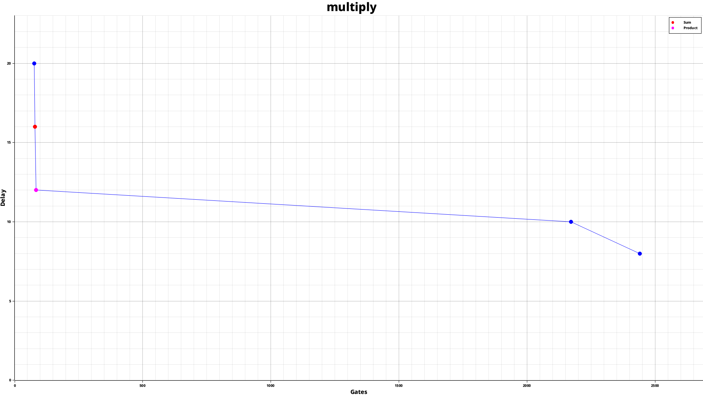

# Pareto frontier graph generator for Turing Complete

## Preliminary questions

### What is Turing Complete?

It's a game, available on Steam, where the player does circuit engineering.

### What is a Pareto frontier graph?

The Pareto frontier are the solutions of a level such that there exist no solution that is stricly better.

## Features

- [x] Generate 2D graphs for circuits levels
- [x] Highlight the Sum and Product records
- [ ] Generate 3D graphs for programming levels
- [ ] Automatically download data from the Leaderboard API
  - [ ] Clean this data from cheated scores
  - [ ] Allow switching between 1.0 and 2.0 leaderboards

## Help

**Usage:** turingpareto <COMMAND>

**Commands:**
  list   List all available levels
  graph  Generate the graph of a level
  help   Print this message or the help of the given subcommand(s)

**Options:**
  -h, --help     Print help
  -V, --version  Print version

## Example

